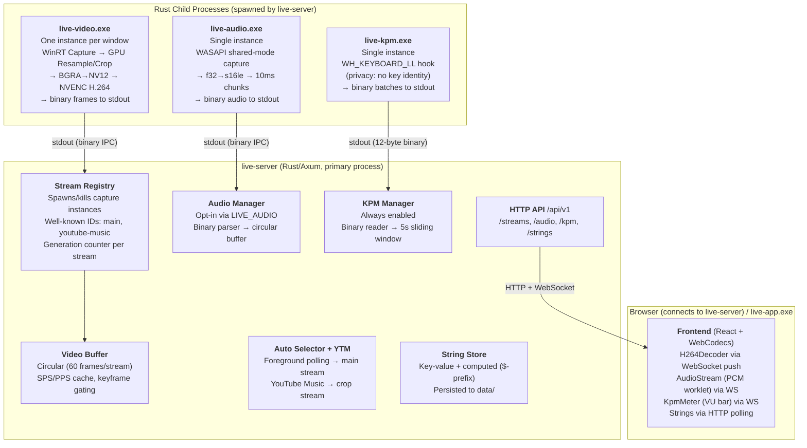

# Nekomaru LiveUI

**Low-latency (<100ms) screen capture streaming from DirectX 11 to the browser**

**Last Updated**: 2026-03-18
**Hardware**: RTX 5090 | Windows 11

---

## Table of Contents

- [Quick Start](#quick-start)
- [Architecture Overview](#architecture-overview)
- [Widget Design](#widget-design)
- [IPC Wire Protocol](#ipc-wire-protocol)
- [HTTP API](#http-api)
- [Implementation Status](#implementation-status)
- [Performance Metrics](#performance-metrics)
- [Encoding Pipeline Reference](#encoding-pipeline-reference)
- [Bugs Fixed & Learnings](#bugs-fixed--learnings)
- [File Structure](#file-structure)
- [Testing Checklist](#testing-checklist)

---

## Quick Start

```bash
# Install: build all Rust crates + frontend dependencies
just install

# Start the server — auto-starts selector, YTM manager, KPM.
# Spawns Vite dev server as a child process for frontend HMR.
# Audio capture is off by default to avoid feedback loops on localhost.
LIVE_PORT=3000 LIVE_VITE_PORT=5173 just server
# Or with audio: LIVE_AUDIO=1 LIVE_PORT=3000 LIVE_VITE_PORT=5173 just server

# Open the frontend — the core server is the entry point.
# It proxies non-API requests to Vite for dev assets.
# http://localhost:3000

# (Optional) Launch the webview host
just app

# (Optional) Launch YouTube Music in a webview
just youtube-music

# (Optional) Manual capture via curl (the server manages "main" and
# "youtube-music" automatically, but you can still create extra streams)
curl -X POST http://localhost:3000/api/v1/streams \
    -H 'Content-Type: application/json' \
    -d '{"hwnd":"0x1A2B3C", "width":1920, "height":1200}'
```

The `app` and `youtube-music` recipes use a copy-and-run pattern (via `.mod.nu`) to avoid Cargo file locks — each gets its own binary copy (`live-app.<id>.exe`), so the server can rebuild freely while webviews are running.

---

## Architecture Overview

### Multi-Executable Design

The project is split into four independently running components, all in Rust.  The server (`live-server`) manages everything: HTTP API, process lifecycle, frame buffering, auto-selector, string store.  Capture processes are spawned as children and communicate via binary IPC over stdout pipes.



### Why This Split?

| Concern | Decision | Rationale |
|---------|----------|-----------|
| GPU capture + encoding | Rust (`live-video`) | Requires `unsafe` Windows APIs, hardware access, zero-copy GPU pipelines. No alternative. |
| Audio capture | Rust (`live-audio`) | WASAPI requires COM + `unsafe`. Same child-process-to-stdout model as video capture. |
| Keystroke counting | Rust (`live-kpm`) | `WH_KEYBOARD_LL` requires Win32 message pump. Privacy-by-design: never reads key identity. Binary IPC to stdout. |
| HTTP server + stream management | Rust (`live-server`, Axum) | Reuses protocol types from lib crates directly (`live_video::read_message()`). No protocol duplication. Single process for all server logic. |
| Webview host | Rust (`live-app`, optional) | Tiny wry wrapper for aspect-ratio-locked window. Could also just use a browser. |
| IPC | Child process stdout | Zero config, natural lifetime (process death = stream death), trivially testable (`live-video > dump.bin`). |
| Frontend dev server | Vite (spawned by live-server) | HMR for React development. The core server reverse-proxies non-API requests to Vite for dev assets. HMR WebSocket connects directly to Vite via `server.hmr.clientPort`. |

### Why RIIR? (Rewrite It In Rust)

The server was originally TypeScript (Hono on Bun).  It was rewritten in Rust for these reasons:

1. **Protocol duplication eliminated.**  The TypeScript server had hand-written binary parsers (`protocol.ts`, `audio-protocol.ts`, `kpm-protocol.ts`) that mirrored the Rust lib crate types.  After RIIR, the server calls `live_video::read_message()` and `live_audio::read_message()` directly — zero parsing code to maintain.

2. **Single process.**  The TypeScript server was a separate process that spawned Rust children.  Now `live-server` is the primary process: it spawns children, manages buffers, serves HTTP, and spawns Vite — all from one binary.  No IPC between server layers, no proxy, no port coordination.

3. **The "iterable" surface was small.**  The original rationale for TypeScript was "fast iteration on the server".  In practice, the string store, selector config, and persistence code changed rarely.  The real iteration happened in the React frontend (served by Vite regardless).

4. **KPM simplification.**  With both ends in Rust, `live-kpm` switched from JSON lines to 12-byte fixed-size binary messages — no serde, no JSON parsing overhead.  The server reads `u64 + u32` directly.

5. **Window enumeration without process spawn.**  The TypeScript server shelled out to `live-video.exe --enumerate-windows` and `--foreground-window` for every poll.  The Rust server calls `enumerate_windows::enumerate_windows()` and `get_foreground_window()` as library functions — no child process, no JSON parse.

6. **Concurrency model fits Rust.**  The 60fps frame polling endpoint is read-heavy (N clients reading concurrently) with brief writes (1 frame push per 16ms).  `tokio::sync::RwLock` handles this naturally.  The TypeScript server was single-threaded by design, which worked but left no room for growth.

### Design Decisions (RIIR)

| Decision | Choice | Why |
|----------|--------|-----|
| Web framework | Axum (tower-based) | De facto standard Rust web framework (2025). No macro magic, native tokio integration, typed extractors. |
| Async runtime | tokio (full features) | Required by Axum. Child process stdout is read on `spawn_blocking` threads. |
| Logging | `pretty_env_logger` | Already in workspace. Simple and sufficient — nobody reads structured logs for a personal streaming tool. |
| Capture processes | Kept as children (not embedded) | A crash in NVENC or WASAPI doesn't take down the server.  Capture binaries use blocking I/O on dedicated threads.  Pipe overhead is negligible (~0.1ms).  Stderr inherited — children log directly via `pretty_env_logger`; `live-video` uses `--stream-id` for multi-instance disambiguation. |
| Buffer concurrency | `tokio::sync::RwLock<StreamRegistry>` | Read-heavy with brief writes.  `broadcast` channels notify WebSocket tasks of new frames/audio; `watch` channel notifies of KPM updates. |
| Frontend transport | WebSocket push + HTTP polling | Video frames, audio chunks, and KPM are pushed over dedicated WebSocket connections (latency-critical).  Strings use HTTP polling at 2s (low-frequency, rarely changes).  HTTP endpoints also kept for CRUD, `/init`, and backward compatibility. |
| Frontend API client | Plain `fetch()` + native `WebSocket` | No runtime dependencies.  `fetch()` for low-frequency HTTP; `WebSocket` with auto-reconnect for streaming data. |
| Frame format (server→browser) | AVCC (server pre-serialized) | The server converts Annex B → AVCC at frame-push time (strip start codes, add 4-byte BE length prefix per NAL).  The frontend feeds AVCC payloads directly to `EncodedVideoChunk` with zero H.264 format knowledge — no parsing, no start code stripping, no AVCC assembly.  Codec string and avcC descriptor are also built server-side and served via `/init`. |
| Vite integration | Spawned as child, reverse-proxied by core server | The core server is the single entry point — the browser connects to `LIVE_PORT`.  Non-API requests are reverse-proxied to Vite via `reqwest`.  HMR WebSocket connects directly to Vite (`hmr.clientPort`).  No Vite-side proxy config needed. |
| Port configuration | `LIVE_PORT` (server, browser entry) + `LIVE_VITE_PORT` (Vite, internal) | Both required, no defaults — avoids conflicts. |
| Build profile | Release by default | All `just` recipes build with `--release`. Performance matters for the low-latency capture pipeline, and we rarely attach a debugger. No separate dev-server recipe — debug builds can be run manually when needed. |
| Webview launch | Copy-and-run via `.mod.nu` | `just app` / `just youtube-music` build `live-app` in release mode, copy as `live-app.<id>.exe`, then run the copy.  Each instance gets its own binary, so `cargo build` (server restart) doesn't hit file locks.  Instance IDs allow frontend and YTM webviews to run simultaneously. |

### Why Not a Monolith?

The previous monolith (`src/app.rs`) mixed window events, GPU capture, encoding, HTTP protocol handling, and webview hosting in one process. It worked, but:

- **Can't view in a normal browser** (wry custom protocol only)
- **Can't run multiple captures** (single encoding thread)
- **Can't iterate on the frontend** without recompiling Rust
- **Can't develop frontend** without the full Rust app running

### File Ownership

Each source file has a primary owner — **agent** (Claude) or **human** (Nekomaru).

- **Agent files**: Claude manages and modifies on request. Nekomaru rarely touches directly.
- **Human files**: Nekomaru hand-crafts with attention to visual style. Claude can work on them but changes are always reviewed and refactored.

See [`FILE-OWNERSHIP.md`](../FILE-OWNERSHIP.md) for the full per-file breakdown.

### Agent Rules

- **Always use `--release`** when invoking `cargo build` or `cargo run`. All binaries in this project are release-built by default.

---

## Widget Design

The left column of the UI hosts **widgets** — small status indicators built from a shared `LiveWidget` component (`frontend/src/widgets.tsx`).

### Layout

Each widget has a consistent three-part structure:

```
┌─────────────────────┐
│  [icon]  Label      │   ← icon (optional) + muted label (text-xs, 60% opacity)
│          Content    │   ← prominent value (text-base, full opacity)
└─────────────────────┘
```

The icon sits to the left of the label+content stack, vertically centered. When no icon is provided the widget collapses to just the two text rows.

### Props

| Prop | Type | Required | Description |
|------|------|----------|-------------|
| `name` | `string` | Yes | Static label displayed in the top row (smaller, muted). |
| `icon` | `ReactNode` | No | Icon rendered in a fixed 20×20 slot to the left. The parent decides what to pass — SVG component, ``, emoji, etc. |
| `children` | `ReactNode` | Yes | Widget content (bottom row). Can be static text or dynamic values from the string store. |

### Dynamic Content

`LiveWidget` is purely presentational. For dynamic values, the parent component calls `useStrings()` to poll the server-managed string store and passes values as `children`:

```tsx
const strings = useStrings();
<LiveWidget name="Microphone" icon={<MicIcon />}>
    {strings.mic ?? "OFF"}
</LiveWidget>
```

### Placement

Widgets are rendered inside `SidePanel` (the left column island in `app.tsx`), which uses `flex-col gap-3` layout. Each widget is a flex item within that container — not its own island.

---

## IPC Wire Protocol

`live-video.exe` writes length-prefixed binary messages to stdout.  `live-server` reads them via `live_video::read_message()` (direct Rust library call — no protocol parser reimplementation).

### Message Format

```
[u8:  message_type]
[u32 LE: payload_length]
[payload_length bytes: payload]
```

### Message Types

#### `0x01` — CodecParams

Sent once after encoder initialization, and again on any IDR frame if parameters change.

```
[u16 LE: width]
[u16 LE: height]
[u16 LE: sps_length]
[sps_length bytes: SPS NAL data]
[u16 LE: pps_length]
[pps_length bytes: PPS NAL data]
```

#### `0x02` — Frame

Sent for every encoded frame.

```
[u64 LE: timestamp_us]
[u8: is_keyframe (0 or 1)]
[u32 LE: num_nal_units]
For each NAL unit:
    [u8: nal_type]
    [u32 LE: data_length]
    [data_length bytes: NAL data with Annex B start code]
```

#### `0xFF` — Error

Non-fatal error. Fatal errors are signaled by process exit.

```
[payload_length bytes: UTF-8 error message]
```

### CLI Interface

Two exclusive capture modes: **resample** (scale full window) or **crop** (extract an absolute subrect at native resolution).

```bash
# Resample mode — scale full window to target resolution
live-video.exe --hwnd 0x1A2B3C --width 1920 --height 1200

# Crop mode — absolute bounding box in source pixels
live-video.exe --hwnd 0x1A2B3C --crop-min-x 0 --crop-min-y 600 --crop-max-x 1920 --crop-max-y 700

# List capturable windows as JSON (includes width/height)
live-video.exe --enumerate-windows

# Get the current foreground window as JSON (used by auto-selector)
live-video.exe --foreground-window

# Dump to file for debugging
live-video.exe --hwnd 0x1A2B3C --width 1920 --height 1200 > capture_dump.bin
```

**Crop mode args:**
- `--crop-min-x <N>` — left edge of the crop rect (inclusive), in source pixels.
- `--crop-min-y <N>` — top edge of the crop rect (inclusive), in source pixels.
- `--crop-max-x <N>` — right edge of the crop rect (exclusive), in source pixels.
- `--crop-max-y <N>` — bottom edge of the crop rect (exclusive), in source pixels.

Non-16-aligned dimensions are accepted; the encoder output is padded to the next multiple of 16. Coordinates are clamped to source bounds at capture time.

Resample args (`--width`/`--height`) and crop args (`--crop-*`) conflict — you pick one mode.

Logging goes to stderr via `pretty_env_logger` with colored output (auto-disabled when piped).  When `--stream-id <ID>` is set, all log lines include `@<ID>` in bold cyan for disambiguation when multiple instances share the server's inherited stderr (e.g. ` INFO @main live_video::encoder > message`).

### KPM Protocol (`live-kpm.exe`)

`live-kpm` uses fixed-size 12-byte binary messages (both ends are Rust, so no JSON overhead needed).  The server reads batches via `live_kpm::read_batch()`.

```
[u64 LE: timestamp_us]   — wall-clock timestamp (microseconds since Unix epoch)
[u32 LE: count]           — number of keystrokes in this batch interval
```

No length prefix or envelope header needed — messages are fixed-size.  EOF signals process exit.

**CLI:**

```bash
# Count keystrokes, batch every 50ms
live-kpm.exe --batch-interval 50
```

`--batch-interval <ms>` is **required** (hard error if omitted). Logging goes to stderr via `pretty_env_logger`.

**Privacy-by-design:** The `WH_KEYBOARD_LL` hook callback never inspects key identity (`vkCode`, `scanCode`, or any `KBDLLHOOKSTRUCT` field). Only the occurrence of `WM_KEYDOWN` / `WM_SYSKEYDOWN` events is counted.

---

## HTTP API

Served by `live-server` (Rust/Axum).  Port is configured via `LIVE_PORT` environment variable (required, no default).  All endpoints are prefixed with `/api/v1`.

### Stream Management

**`GET /api/v1/streams`** — List active capture streams.

```json
[
    { "id": "main", "hwnd": "0x1A2B3C", "status": "running", "generation": 3 }
]
```

**`POST /api/v1/streams`** — Create a new capture (spawns a `live-video.exe` instance). Accepts either resample mode or crop mode (mutually exclusive).

```json
// Resample mode — scale the full window to fit width × height
{ "hwnd": "0x1A2B3C", "width": 1920, "height": 1200 }

// Crop mode — absolute bounding box in source pixels
{ "hwnd": "0x1A2B3C", "cropMinX": 0, "cropMinY": 600, "cropMaxX": 1920, "cropMaxY": 700 }

// Response (both modes)
{ "id": "abc123" }
```

**`DELETE /api/v1/streams/:id`** — Stop and remove a capture (kills the child process).

### Stream Data

**`GET /api/v1/streams/:id/init`** — Pre-built decoder configuration. The server derives the `avc1.PPCCLL` codec string and builds the ISO 14496-15 AVCDecoderConfigurationRecord (avcC) from the cached SPS/PPS — the frontend passes these directly to `VideoDecoder.configure()` with zero H.264 format knowledge.

```json
{
    "codec": "avc1.42001f",
    "width": 1920,
    "height": 1200,
    "description": "<base64 of avcC descriptor>"
}
```

**`GET /api/v1/streams/windows`** — List capturable windows (direct library call to `enumerate_windows::enumerate_windows()` — no child process spawn).

### Auto Window Selector

**`GET /api/v1/streams/auto`** — Get auto-selector status.

```json
{ "active": true, "currentStreamId": "main", "currentHwnd": "0x1A2B3C", "currentTitle": "MyApp — Window Title" }
```

**`POST /api/v1/streams/auto`** — Start the auto-selector (idempotent). Polls the foreground window every 2 seconds and automatically switches captures when the foreground matches the include list. The managed stream always has ID `"main"`.

**`DELETE /api/v1/streams/auto`** — Stop the auto-selector and destroy the `"main"` stream.

**`GET /api/v1/streams/auto/config`** — Get the auto-selector's full preset config.

```json
{
    "preset": "default",
    "presets": {
        "default": [
            "@code devenv.exe",
            "@code C:\\Program Files\\JetBrains\\",
            "@game D:\\7-Games\\",
            "@exclude gogh.exe",
            "@exclude vtube studio.exe"
        ],
        "gaming": [
            "@game D:\\7-Games\\"
        ]
    }
}
```

**`PUT /api/v1/streams/auto/config`** — Replace the full preset config. Each preset is a flat `string[]` of pattern entries. Entries are include rules by default; `@exclude` prefix marks an exclusion rule. Include entries may carry an optional `@mode ` prefix (e.g. `@code devenv.exe`) that is pushed as the `$liveMode` computed string on capture switch. The full pattern format is `[@mode] <exePath>[@<windowTitle>]`. If no `@` separator is present in the body, only the executable path is matched. When both parts are given, both must match (AND). The title part is always compared case-insensitively. Exclude patterns also compare the exe path case-insensitively.

```json
// Request body
{
    "preset": "default",
    "presets": {
        "default": [
            "@code devenv.exe",
            "@code Code.exe@LiveUI",
            "@exclude gogh.exe"
        ]
    }
}

// Response
{ "ok": true }
```

**`PUT /api/v1/streams/auto/config/preset`** — Switch the active preset by name. Accepts a plain string body (the preset name). Reloads config from disk first. Returns 400 if the body is empty or the preset doesn't exist.

```
// Request body (text/plain)
gaming

// Response
{ "ok": true }
```

### String Store

Server-managed key-value string store. The control panel (or curl) writes values; the frontend polls and displays them at designated locations by well-known ID.

Keys prefixed with `$` are **computed strings** — readonly values derived from live server state, not backed by any storage. They appear in GET responses alongside regular strings but cannot be written or deleted via the API (returns 403). Producers push values via `StringStore::set_computed()` / `clear_computed()` in `live-server/src/strings/store.rs`.

**Current computed strings:**

| Key | Source | Description |
|-----|--------|-------------|
| `$captureInfo` | Auto selector | Human-readable label for the captured window. Prefers the executable's FileDescription from PE version info (e.g. "Visual Studio Code"); falls back to the window title when unavailable. |
| `$captureMode` | Auto selector | Current capture mode — `"auto"` when the selector is active, absent when stopped. |
| `$liveMode` | Auto selector | Live mode derived from the matched include pattern's `@mode` tag (e.g. `"code"`, `"sing"`). Absent when no mode tag on the matched pattern or selector stopped. |
| `$timestamp` | Server startup | Revision timestamp of the `@-` jj revision, read via `jj log` at server boot. Displayed in the About widget. |

**`GET /api/v1/strings`** — Get all key-value pairs (including computed strings).

```json
{ "test": "Hello World", "banner": "Live now!", "$captureInfo": "Visual Studio Code" }
```

**`PUT /api/v1/strings/:key`** — Set a string value (idempotent). Returns 403 for `$`-prefixed keys.

```json
// Request body
{ "value": "Hello World" }

// Response
{ "ok": true }
```

**`DELETE /api/v1/strings/:key`** — Delete a string. Returns 403 for `$`-prefixed keys.

```json
{ "ok": true }
```

### WebSocket Streaming

Latency-critical data is pushed over dedicated WebSocket connections, eliminating per-request TCP overhead.  Low-frequency data (strings, stream status) remains HTTP-polled.

**`WS /api/v1/ws/video/:id`** — Video frames (binary push).  On connect, the client may send `{"after": N}` to set its cursor; the server sends a catch-up batch, then pushes frames as they arrive via `broadcast` notification.  Binary layout: `[u32 generation][u32 num_frames] per frame: [u32 sequence][u64 timestamp_us][u8 is_keyframe][u32 avcc_len][avcc bytes]` (all LE).

**`WS /api/v1/ws/audio`** — Audio chunks (binary push, raw PCM — no delta encoding or gzip).  Same cursor protocol as video.  Binary layout: `[u32 num_chunks] per chunk: [u32 sequence][u32 payload_len][payload]` where payload is `[u64 timestamp_us][s16le PCM]`.

**`WS /api/v1/ws/kpm`** — KPM updates (JSON text push).  Sends `{"kpm": N}` or `{"kpm": null}` on every value change via `watch` channel.  Initial value sent immediately on connect.

### Refresh

**`POST /api/v1/refresh`** — Reload selector config and string store from their local files (`data/selector-config.json`, `data/strings.json`). Useful after editing these files by hand or via an external tool.

```json
{ "ok": true }
```

---

## Implementation Status

### Completed (`live-video` crate — `live-video/`)

| Component | File | Status | Notes |
|-----------|------|--------|-------|
| **IPC Protocol (lib)** | `live-video/src/lib.rs` | Done | Wire protocol types (`NALUnit`, `CodecParams`, `FrameMessage`) + serialization/deserialization via `impl Write`/`impl Read`. `read_message()` reused directly by `live-server` — no protocol parser reimplementation. Round-trip tested. |
| **CLI + Orchestration** | `live-video/src/main.rs` | Done | Two exclusive capture modes: resample (`--width`/`--height`) and crop (`--crop-min-x/y`/`--crop-max-x/y` absolute box). `--enumerate-windows` and `--foreground-window` one-shot modes. `--stream-id <ID>` tags log lines with `@<ID>` for multi-instance disambiguation. Per-monitor DPI aware via `set-dpi-awareness` crate. Bakery model: capture thread + encoding thread → binary stdout. Colored log output: level (env_logger default colors), `@tag` (bold cyan), target (dim gray) — colors auto-disable when piped. Dual-output logging: encoder init diagnostics (info/debug/trace) → `live-video.encoder.log` next to exe (truncated per capture run); warn/error + all other modules → stderr (inherited from server). Utility modes skip log file creation to avoid truncating a concurrent capture's log. |
| **D3D11 Helpers** | `live-video/src/d3d11.rs` | Done | Device creation, texture/view factories (subset of monolith `app/helper.rs`) |
| **Format Converter** | `live-video/src/converter.rs` | Done | GPU-accelerated BGRA→NV12 via `ID3D11VideoProcessor`. Resolution now parameterized. |
| **H.264 Encoder** | `live-video/src/encoder.rs` | Done | Async MFT with low-latency settings, NAL parsing. Callbacks passed to `run()` (monomorphized, no `Box<dyn>`). |
| **Encoder Helpers** | `live-video/src/encoder/helper.rs` | Done | Finds NVIDIA NVENC encoder |
| **Debug Logging** | `live-video/src/encoder/debug.rs` | Done | Prints supported media types |
| **Resampler** | `live-video/src/resample.rs` | Done | Scales captured frames with viewport set |
| **Capture + Crop** | `live-video/src/capture.rs` | Done | Windows Graphics Capture wrapper + viewport calculation. `CropBox` (absolute min/max coordinates) with `to_d3d11_box()` for subrect extraction via `CopySubresourceRegion`. |
| **Window Enumeration** | `crates/enumerate-windows/src/lib.rs` | Done | `enumerate_windows()` lists capturable windows (with client-area width/height in physical pixels). `get_foreground_window()` returns current foreground window info. Called as a library by `live-server` (no process spawn). |
| **DPI Awareness** | `crates/set-dpi-awareness/src/lib.rs` | Done | Thin wrapper: `per_monitor_v2()` calls `SetProcessDpiAwarenessContext(DPI_AWARENESS_CONTEXT_PER_MONITOR_AWARE_V2)`. Used by `live-video` and `live-server` at startup so Win32 geometry APIs return physical pixels. |

### Completed (Frontend Video Module — `frontend/src/video/`)

| Component | File | Status | Notes |
|-----------|------|--------|-------|
| **Decoder** | `frontend/src/video/decoder.ts` | Done | Thin WebCodecs wrapper — zero H.264 format knowledge. Server provides pre-built codec string + avcC descriptor (via `/init`) and AVCC-formatted frame payloads (via WS). `fetchInit()` retries on 503 (starting) and 404 (stream not yet created). `decodeFrame()` passes AVCC data directly to `EncodedVideoChunk` with no conversion. |
| **Renderer** | `frontend/src/video/index.tsx` | Done | `<StreamRenderer>` component. Canvas rendering via WebSocket push. Generation-aware: reinitializes decoder when the server replaces the underlying capture process. Reinit retries in a loop on failure. Owns full decoder lifecycle via `startStreamLoop()` with auto-reconnect + exponential backoff. Uses `openWebSocket()` + `wsMessages()` async generator from `ws.ts`. |

### Completed (`live-audio` crate — `live-audio/`)

| Component | File | Status | Notes |
|-----------|------|--------|-------|
| **IPC Protocol (lib)** | `live-audio/src/lib.rs` | Done | Wire protocol types (`AudioParams`, `AudioFrame`) + serialization. Message types: `0x10` AudioParams (sample rate, channels, bits), `0x11` AudioFrame (timestamp + PCM), `0xFF` Error. `read_message()` reused directly by `live-server`. |
| **CLI + Capture Loop** | `live-audio/src/main.rs` | Done | WASAPI shared-mode capture. `--device` name-matched lookup, `--list-devices` enumeration mode. Captures at device native rate, outputs fixed 10ms s16le chunks. f32→s16 conversion with clamping. 5ms poll sleep, 40ms WASAPI buffer. MMCSS "Pro Audio" thread registration for guaranteed scheduling under heavy CPU load. Broken pipe → clean exit (reverts MMCSS). Logging via `pretty_env_logger` to stderr (inherited by server). |

### Completed (Frontend Audio Module — `frontend/src/audio/`)

| Component | File | Status | Notes |
|-----------|------|--------|-------|
| **Audio Stream** | `frontend/src/audio/index.tsx` | Done | Invisible `<AudioStream>` component. Receives PCM chunks via `WS /ws/audio` (raw, no delta/gzip). Posts to worklet immediately — no A/V sync. Auto-reconnect with exponential backoff. Handles browser autoplay policy. Exits gracefully on 404 (audio disabled). |
| **PCM Worklet** | `frontend/src/audio/worklet.ts` | Done | AudioWorklet processor with ring buffer (9600 frames = 200ms at 48kHz). Receives s16le via MessagePort, converts to f32, outputs at audio callback rate. Silence on underrun. |

### Completed (`live-kpm` crate — `live-kpm/`)

| Component | File | Status | Notes |
|-----------|------|--------|-------|
| **Binary Protocol (lib)** | `live-kpm/src/lib.rs` | Done | Fixed 12-byte binary protocol. `Batch` type with `t` (timestamp_us, u64 LE) and `c` (count, u32 LE). `write_batch()` / `read_batch()`. No envelope header — fixed message size. Round-trip tested. |
| **CLI + Capture Loop** | `live-kpm/src/main.rs` | Done | `WH_KEYBOARD_LL` system-wide hook. Required `--batch-interval` arg. Main thread: Win32 message pump. Writer thread: timer loop, `AtomicU32` counter → 12-byte binary batches to stdout. Privacy-by-design: never reads `vkCode`/`scanCode`. Broken pipe → clean exit via `PostQuitMessage`. |

### Completed (Frontend KPM Module — `frontend/src/kpm/`)

| Component | File | Status | Notes |
|-----------|------|--------|-------|
| **KPM Meter** | `frontend/src/kpm.tsx` | Done | `useKpm()` hook receives values via `WS /ws/kpm` with inline reconnect loop (exponential backoff, resets on successful connect). Frontend-computed peak hold (1.5s hold + 0.5s linear decay). `<KpmMeter>` renders vertical VU-style bar with LED segments, neon accent color (tracks island hue via `currentColor`), prominent peak marker with glow, live KPM readout + keyboard icon label. |

### Completed (Webview Host — `live-app/`)

| Component | File | Status | Notes |
|-----------|------|--------|-------|
| **live-app** | `live-app/src/main.rs` | Done | Non-resizable 1280x800 wry webview via nkcore/winit event loop. CLI args: `--url`, `--window-title`, `--scaling-factor`. |

### Completed (`live-server` — Rust/Axum, `live-server/`)

Replaces the former TypeScript Hono server.  All server logic is now Rust.  Modules are grouped by logical component (video, audio, KPM, selector, etc.) — each co-locates its buffer, process manager, and HTTP routes.

| Component | File(s) | Status | Notes |
|-----------|---------|--------|-------|
| **Entry Point** | `live-server/src/main.rs` | Done | Axum HTTP + WebSocket server. Single entry point — the browser connects here. Per-monitor DPI aware. CLI args via clap. Auto-starts selector, YTM manager, KPM on boot. Audio gated by `LIVE_AUDIO`. Spawns Vite as child when `LIVE_VITE_PORT` is set; non-API requests are reverse-proxied to Vite for dev assets. |
| **Constants** | `live-server/src/constant.rs` | Done | Centralized well-known values: data paths, stream IDs (`STREAM_ID_MAIN`, `STREAM_ID_YTM`), computed string keys (`CSID_*`), capture defaults, buffer capacities, poll intervals, YTM crop geometry (`ytm_crop_geometry()`), default selector config (`default_selector_config()` via `json!`). |
| **Shared State** | `live-server/src/state.rs` | Done | `AppState` with per-subsystem `Arc<RwLock<T>>`. Accessor methods for read/write locks and cloneable `Arc` handles for child-process reader tasks. |
| **Video Buffer** | `live-server/src/video/buffer.rs` | Done | Per-stream circular buffer (60 frames). Annex B → AVCC conversion at push time (`strip_start_code` + 4-byte BE length prefix per NAL). Keyframe gating for first client request. `build_codec_string()` / `build_avcc_descriptor()` for the `/init` endpoint — both strip start codes from `CodecParams.sps`/`.pps` (which contain raw `NALUnit.data` with Annex B prefixes). `reset()` on stream replacement. 15 unit tests. |
| **Video Process** | `live-server/src/video/process.rs` | Done | `StreamRegistry` with `CaptureStream` entries. `spawn_and_wire()` spawns `live-video.exe` with `--stream-id`, reads stdout via `live_video::read_message()` on `spawn_blocking` thread, pushes into buffer. `broadcast::Sender<()>` per stream fires after each frame push — wakes WebSocket tasks. Generation-guarded: stale readers never touch the new generation's buffer. |
| **Video Routes** | `live-server/src/video/routes.rs` | Done | `GET/POST /streams`, `DELETE /streams/:id`, `GET /streams/:id/init` (codec string + avcC base64). |
| **Video WebSocket** | `live-server/src/video/ws.rs` | Done | `WS /ws/video/:id` — subscribes to `broadcast`, pushes AVCC frames in same binary format as HTTP. Cursor sync via `{"after": N}` on connect. |
| **Audio Buffer** | `live-server/src/audio/buffer.rs` | Done | Circular chunk buffer (100 chunks = ~1s). Pre-serialized payloads. Generation reset detection (stale cursor → return all). 4 unit tests. |
| **Audio Process** | `live-server/src/audio/process.rs` | Done | `AudioState` singleton. Spawns `live-audio.exe`, reads stdout via `live_audio::read_message()`. `broadcast::Sender<()>` fires after each chunk push. Stderr inherited. Reset on process exit. |
| **Audio Routes** | `live-server/src/audio/routes.rs` | Done | `GET /audio/init` (format params, 503/404). |
| **Audio WebSocket** | `live-server/src/audio/ws.rs` | Done | `WS /ws/audio` — pushes raw PCM chunks (no delta encoding, no gzip). Same cursor protocol as video. |
| **KPM Calculator** | `live-server/src/kpm/calculator.rs` | Done | 5-second sliding window with `VecDeque`. Extrapolates to KPM. No peak tracking (frontend handles it). 5 unit tests. |
| **KPM Process** | `live-server/src/kpm/process.rs` | Done | `KpmState` singleton. Spawns `live-kpm.exe`, reads 12-byte binary batches via `live_kpm::read_batch()`. `watch::Sender<Option<i64>>` updated after each batch — carries the rounded KPM value. Stderr inherited. Always enabled. |
| **KPM WebSocket** | `live-server/src/kpm/ws.rs` | Done | `WS /ws/kpm` — pushes `{"kpm": N}` on every `watch` change. Sends current value immediately on connect. |
| **Selector Config** | `live-server/src/selector/config.rs` | Done | `PresetConfig` with persistence to `data/selector-config.json`. Pattern parser: `[@mode] <exePath>[@<windowTitle>]`. `should_capture()` with exclude-veto semantics. Path separator normalization. Legacy format migration. 9 unit tests. |
| **Selector Manager** | `live-server/src/selector/manager.rs` | Done | `SelectorState`. Polls foreground window every 2s via `enumerate_windows::get_foreground_window()` (direct library call). Replaces `"main"` stream on match. Pushes `$captureInfo` (exe FileDescription, falls back to window title), `$liveMode`, `$captureMode` computed strings. |
| **Selector Routes** | `live-server/src/selector/routes.rs` | Done | `GET/POST/DELETE /streams/auto`, `GET/PUT /streams/auto/config`, `PUT /streams/auto/config/preset`. |
| **YTM Manager** | `live-server/src/ytm/manager.rs` | Done | `YtmState`. Polls `enumerate_windows()` every 5s, finds "YouTube Music" window. Creates/replaces `"youtube-music"` crop stream (bottom playback bar). Destroys on window disappearance. |
| **String Store** | `live-server/src/strings/store.rs` | Done | `StringStore` with `HashMap<String, String>` (user) + `HashMap<String, String>` (computed, `$`-prefixed). Dual-layer persistence: `data/strings.json` (single-line) + `data/strings/<key>.md` (multiline). Strict mode: crash on corrupt JSON. |
| **String Routes** | `live-server/src/strings/routes.rs` | Done | `GET /strings` (all, merged), `PUT /strings/:key` (set, 403 for `$`), `DELETE /strings/:key`. |
| **Window Enumeration** | `live-server/src/windows.rs` | Done | `GET /streams/windows` — calls `enumerate_windows::enumerate_windows()` on `spawn_blocking` thread. No process spawn. |
| **Vite Dev Proxy** | `live-server/src/vite_proxy.rs` | Done | Catch-all fallback: reverse-proxies non-API requests to the Vite dev server via `reqwest`. Active only when `LIVE_VITE_PORT` is set. HMR WebSocket connects directly to Vite (not proxied). |

### Completed (Frontend — React + WebSocket + HTTP polling)

| Component | File | Status | Notes |
|-----------|------|--------|-------|
| **WebSocket Helper** | `frontend/src/ws.ts` | Done | Low-level WS utilities for binary streaming: `openWebSocket()` (promise-based connect), `wsMessages()` (async generator yielding `ArrayBuffer`). Tied to `AbortSignal` for clean teardown. Used by video and audio modules. |
| **API Client** | `frontend/src/api.ts` | Done | Plain `fetch()` wrapper — `fetchStreams()` returns typed `StreamInfo[]`. Used by `useStreamStatus()` (low-frequency HTTP polling). |
| **Strings API Client** | `frontend/src/strings-api.ts` | Done | Plain `fetch()` wrapper — `fetchStrings()` returns `Record<string, string>`. Used by `useStrings()`. |
| **Stream Status** | `frontend/src/streams.ts` | Done | `useStreamStatus()` hook. Polls `GET /api/v1/streams` every 2s, returns `{ hasMain, hasYouTubeMusic }` booleans for UI visibility. Still HTTP (low-frequency, not latency-sensitive). |
| **String Store Hook** | `frontend/src/strings.ts` | Done | `useStrings()` hook. Polls `GET /api/v1/strings` every 2s, returns `Record<string, string>` of all key-value pairs. |
| **App** | `frontend/src/app.tsx` | Done | Pure viewer shell. JetBrains Islands dark theme. Hardcoded `streamId="main"` and `streamId="youtube-music"`. YouTube Music island shown/hidden via `useStreamStatus()`. Displays server-managed strings by well-known ID (e.g. `"marquee"` in scrolling top banner, `"message"` in sidebar). SidePanel hosts Clock, Mode, Capture, message area, and About widgets. No control buttons — all lifecycle is server-managed. |
| **Widgets** | `frontend/src/widgets/index.tsx` | Done | All widgets in one file: `ClockWidget` (dual timezone), `LiveModeWidget` (`$liveMode`, small), `CaptureWidget` (capture mode + exe description, large), `AboutWidget` (revision timestamp + credits, large). Shared `LiveWidget` base in `widgets/common.tsx`. |
| **Entry Point** | `frontend/index.tsx` | Done | React 19 `createRoot()` (migrated from Preact). |
| **Vite Config** | `frontend/vite.config.ts` | Done | `@vitejs/plugin-react-swc` + `@tailwindcss/vite`, `root: "."`, `@` alias. No proxy — the core server is the browser entry point and reverse-proxies to Vite. `server.hmr.clientPort` for direct HMR connection. |

---

## Performance Metrics

### Latency Breakdown (Estimated)

| Component | Time | Method |
|-----------|------|--------|
| Capture | 0-16ms | Windows Graphics Capture (1 frame buffer) |
| Resample | 0.5-1ms | GPU shader (fullscreen triangle) |
| GPU Flush + Wait | 5ms | `Flush()` + `sleep(5ms)` |
| BGRA→NV12 | 0.5-1ms | `ID3D11VideoProcessor` |
| GPU Flush | 1-2ms | `Flush()` |
| H.264 Encode | 5-15ms | NVENC hardware encoder |
| NAL Parse | <0.1ms | CPU Annex B parsing |
| IPC (stdout) | <0.1ms | Pipe buffer, same machine |
| HTTP response | <1ms | Localhost |
| **Total** | **13-36ms** | Well under 100ms target |

### Frame Sizes (1920x1200 @ 8 Mbps CBR)

| Frame Type | Size Range | Scenario |
|------------|------------|----------|
| **IDR (keyframe)** | ~67 KB | SPS(27B) + PPS(8B) + full I-frame |
| **P-frame (static)** | 1.5-10 KB | Mostly unchanged screen content |
| **P-frame (typing/scrolling)** | 10-30 KB | Text editing, web browsing |
| **P-frame (high motion)** | 30-50 KB | Video playback, animations |

**Red Flags:**
- 12-byte P-frames → Empty/black frames (viewport bug)
- 9KB IDR → Possible empty first frame

### Encoding Settings

| Setting | Value | Reason |
|---------|-------|--------|
| Profile | H.264 Baseline | No B-frames, WebCodecs compatibility |
| Bitrate | 8 Mbps CBR | Constant for predictable latency |
| Frame Rate | 60 fps | Encoder runs at constant 60fps |
| GOP Size | 120 frames (2 sec) | Fast recovery from packet loss |
| B-frames | 0 | Baseline profile prohibits (low latency) |
| Low Latency Mode | Enabled | `CODECAPI_AVLowLatencyMode = true` |

---

## Encoding Pipeline Reference

### Format Converter (`live-video/src/converter.rs`)

GPU-accelerated BGRA→NV12 conversion via `ID3D11VideoProcessor`. Hardware H.264 encoders require NV12 input.

Performance: ~0.5-1ms for 1920x1200.

### H.264 Encoder (`live-video/src/encoder.rs`)

Async Media Foundation Transform (MFT). Runs a blocking event loop:

- `METransformNeedInput` → read from staging texture, convert, feed to encoder
- `METransformHaveOutput` → parse NAL units, write to stdout

NAL unit types: SPS(7) ~27B, PPS(8) ~8B, IDR(5) ~67KB, NonIDR(1) ~1.5-30KB.

### "Bakery Model" (Capture Thread ↔ Encoding Thread)

Within `live-video.exe`, the capture thread (main) and encoding thread share a staging texture ("the shelf"). The capture thread continuously restocks it with the latest captured frame; the encoding thread reads at a constant 60fps. No channels, no CPU copies — just a shared GPU texture with `Flush()` synchronization.

**Trade-off**: Encoder may encode the same frame twice if capture is slow. Acceptable for live streaming.

---

## Bugs Fixed & Learnings

### Bug #1: Codec API Settings Order

**Problem**: `ICodecAPI::SetValue()` before media types → "parameter is incorrect"

**Fix**: Set media types first, then codec API values. Correct order:
1. Output media type (H.264, resolution, frame rate, bitrate, profile)
2. Input media type (NV12, resolution, frame rate)
3. D3D manager (attach GPU device)
4. Codec API values (B-frames, GOP, latency mode, rate control)
5. Start streaming

### Bug #2: VARIANT Type Mismatch

**Problem**: B-frame count setting failed with `VT_UI4`.

**Fix**: Use `i32` (signed) for all codec API values: `VARIANT::from(0i32)`.

### Bug #3: Missing Viewport → Empty Frames

**Problem**: All P-frames were 12 bytes (black frames). Resampler didn't set viewport → GPU clipped fullscreen triangle → empty output.

**Fix**: Always set `RSSetViewports()` before draw calls.

**Lesson**: D3D11 draw calls require explicit viewport, scissor, and render target setup.

### Bug #4: CodecParams SPS/PPS Include Annex B Start Codes

**Problem**: After moving Annex B → AVCC conversion to the server, `build_codec_string()` produced `avc1.000001` instead of `avc1.42001f`. The `CodecParams.sps` doc comment said "raw NAL data without start code", but the encoder populates it from `NALUnit.data` which **includes** the Annex B start code (`00 00 00 01`).

**Fix**: `build_codec_string()` and `build_avcc_descriptor()` now call `strip_start_code()` before accessing SPS/PPS bytes. The old frontend code did this too (calling `stripStartCode()` after base64 decode) — it wasn't redundant.

**Lesson**: Don't trust doc comments over actual data flow. Trace the bytes from producer to consumer.

### Bug #5: Stream Switch Freezes Frontend on Old Frame

**Problem**: When the auto-selector switched the "main" stream to a new foreground window, the frontend canvas stayed frozen on the last frame from the old stream. The old `live-video.exe` reader task (running on `tokio::task::spawn_blocking`) could not be cancelled by `JoinHandle::abort()` — it continued draining the OS pipe buffer after the stream was replaced. The stale reader could overwrite `codec_params` with old SPS/PPS after the new reader had set the correct params, causing the frontend's decoder to be configured for the wrong stream. Additionally, if `decoder.init()` threw during reinit, the stream loop continued with an unconfigured decoder that silently dropped all frames.

**Fix**: (1) `spawn_and_wire()` now receives the stream's generation number. The reader task checks `stream.generation == my_generation` before every write — stale readers exit silently. (2) The frontend's reinit path retries `decoder.init()` in a loop instead of falling through with a broken decoder.

**Lesson**: `tokio::task::spawn_blocking` tasks are not cancellable — `JoinHandle::abort()` only drops the handle, the blocking thread keeps running. Any shared mutable state accessed by a `spawn_blocking` task needs an explicit validity check (here: generation number) to prevent stale writes after the owning context has moved on.

---

## File Structure

```
Nekomaru-LiveUI-v2/
├── Cargo.toml                       # Workspace root
├── .justfile                        # Task runner recipes (just)
├── .mod.nu                          # Nushell module: copy-and-run helper for live-app
│
├── data/                            # Persisted runtime data (gitignored)
│   ├── strings.json                 # String store key-value pairs
│   ├── strings/                     # Per-key Markdown files for multiline values
│   └── selector-config.json         # Auto-selector preset config
│
├── live-server/                     # HTTP + WebSocket server (Rust, Axum + tokio)
│   ├── Cargo.toml
│   └── src/
│       ├── main.rs                  # Entry point: Axum, CLI args, Vite child, signal handling
│       ├── constant.rs              # Centralized constants, well-known IDs, computed string keys
│       ├── state.rs                 # AppState (Arc<RwLock<...>> per subsystem)
│       ├── vite_proxy.rs            # Dev fallback: reverse-proxies non-API requests to Vite
│       ├── video/                   # Video capture pipeline
│       │   ├── buffer.rs            # Circular frame buffer (Annex B→AVCC, keyframe gating, avcC builder)
│       │   ├── process.rs           # StreamRegistry, spawn live-video, broadcast notify
│       │   ├── routes.rs            # /api/v1/streams CRUD, /init (HTTP)
│       │   └── ws.rs                # WS /api/v1/ws/video/:id (binary frame push)
│       ├── audio/                   # Audio capture pipeline
│       │   ├── buffer.rs            # Circular audio chunk buffer
│       │   ├── process.rs           # AudioState, spawn live-audio, broadcast notify
│       │   ├── routes.rs            # /api/v1/audio/init (HTTP)
│       │   └── ws.rs                # WS /api/v1/ws/audio (binary chunk push, raw PCM)
│       ├── kpm/                     # KPM pipeline
│       │   ├── calculator.rs        # Sliding window KPM calculator (5s window)
│       │   ├── process.rs           # KpmState, spawn live-kpm, watch notify
│       │   └── ws.rs                # WS /api/v1/ws/kpm (JSON text push)
│       ├── selector/                # Auto window selector
│       │   ├── config.rs            # Preset parsing, pattern matching, persistence
│       │   ├── manager.rs           # Foreground polling, stream replacement
│       │   └── routes.rs            # /api/v1/streams/auto, /auto/config
│       ├── ytm/                     # YouTube Music manager
│       │   └── manager.rs           # Window polling, crop stream management
│       ├── strings/                 # String store
│       │   ├── store.rs             # Map + computed strings + dual-layer persistence
│       │   └── routes.rs            # /api/v1/strings CRUD (HTTP)
│       └── windows.rs               # /api/v1/streams/windows (library call)
│
├── live-video/                      # live-video.exe + live_video lib (was live-capture)
│   ├── Cargo.toml
│   └── src/
│       ├── lib.rs                   # Video IPC protocol (reused by live-server)
│       ├── main.rs                  # CLI: resample vs crop mode, capture → encode → stdout
│       ├── d3d11.rs, capture.rs, converter.rs, encoder.rs, resample.rs
│       └── encoder/                 # NVENC helpers
│
├── live-audio/                      # live-audio.exe + live_audio lib
│   ├── Cargo.toml
│   └── src/
│       ├── lib.rs                   # Audio IPC protocol (reused by live-server)
│       └── main.rs                  # WASAPI capture, f32→s16le, 10ms chunks → stdout
│
├── live-kpm/                        # live-kpm.exe + live_kpm lib
│   ├── Cargo.toml
│   └── src/
│       ├── lib.rs                   # Binary IPC protocol (12-byte fixed messages)
│       └── main.rs                  # WH_KEYBOARD_LL hook, message pump, binary batch writer
│
├── live-app/                        # Webview host (wry)
│   ├── Cargo.toml
│   └── src/main.rs
│
├── crates/
│   ├── enumerate-windows/           # Window enumeration helper crate (used as library by live-server)
│   └── set-dpi-awareness/           # Per-monitor DPI awareness v2 (used by live-video + live-server)
│
└── frontend/                        # Frontend (React + Vite + Tailwind)
    ├── package.json
    ├── tsconfig.json
    ├── vite.config.ts               # Vite, @→src alias, /api proxy to live-server
    ���── biome.json                   # Biome formatter/linter config
    ├── index.html
    ├── index.tsx                    # Entry point (React 19 createRoot)
    ├── global.css                   # CSS vars, dark gradient background, layout
    ├── global.tailwind.css          # Tailwind base import
    ├── debug.ts                     # Debug flags
    ├── src/                         # Application source (aliased as @/)
    │   ├── ws.ts                    # Low-level WebSocket helpers (openWebSocket, wsMessages)
    │   ├── api.ts                   # Plain fetch() wrapper for /api/v1/streams
    │   ├── app.tsx                  # Pure viewer shell (streams + server-managed strings by ID)
    │   ├── streams.ts               # useStreamStatus() hook (polls availability for UI visibility)
    │   ├── strings-api.ts           # Plain fetch() wrapper for /api/v1/strings
    │   ├── strings.ts               # useStrings() hook (polls /api/v1/strings every 2s)
    │   ├── kpm.tsx                  # useKpm() hook (WS push, inline reconnect) + <KpmMeter> VU meter
    │   ├── widgets/                 # SidePanel widgets
    │   │   ├── common.tsx           # LiveWidget base component (icon + label + content layout)
    │   │   └── index.tsx            # All widgets: Clock, Status, Capture, About
    │   ├── audio/                   # Audio streaming module
    │   │   ├── index.tsx            # <AudioStream> (WS push, raw PCM to worklet)
    │   │   └── worklet.ts           # PCM AudioWorklet processor (ring buffer, s16→f32)
    │   └── video/                   # Self-contained video stream module
    │       ├── index.tsx            # <StreamRenderer> (WS push, generation-aware decoder lifecycle)
    │       ├── decoder.ts           # H264Decoder (thin WebCodecs wrapper, server provides AVCC)
    │       └── chroma-key.ts        # WebGL2 chroma-key renderer (GPU fragment shader)
    └── public/
        └── img/
```

---

## Known Issues

### 1. Hardcoded NVIDIA Encoder

Only selects encoders with "nvidia" in name. Fails on Intel/AMD.
**Priority**: Low (personal use, RTX 5090).

### 2. No Error Recovery

Encoding errors cause panic (`.unwrap()` / `.expect()`).
**Priority**: Medium. Should skip frames and log to stderr instead.

---

## References

### Windows API
- [Media Foundation Transforms](https://learn.microsoft.com/en-us/windows/win32/medfound/media-foundation-transforms)
- [H.264 Video Encoder](https://learn.microsoft.com/en-us/windows/win32/medfound/h-264-video-encoder)
- [ID3D11VideoProcessor](https://learn.microsoft.com/en-us/windows/win32/api/d3d11/nn-d3d11-id3d11videoprocessor)
- [Async MFTs](https://learn.microsoft.com/en-us/windows/win32/medfound/asynchronous-mfts)

### Web Standards
- [WebCodecs API](https://w3c.github.io/webcodecs/)
- [H.264 Specification](https://www.itu.int/rec/T-REC-H.264)
- [ISO 14496-15 (AVC File Format)](https://www.iso.org/standard/55980.html)

---

**Author**: Nekomaru
**Co-Pilot**: Claude
**Hardware**: NVIDIA GeForce RTX 5090
**License**: Personal Use Only
