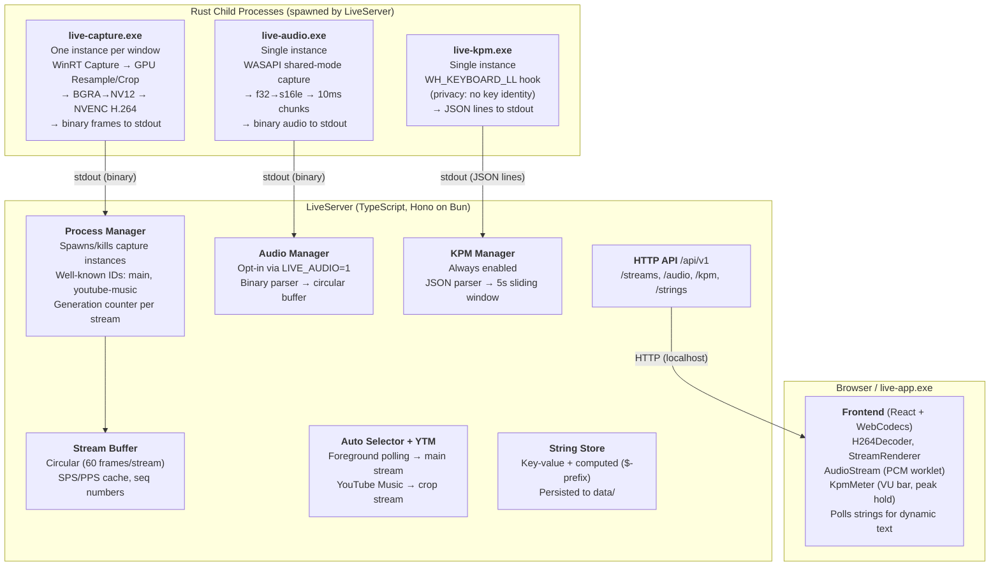

# Nekomaru LiveUI

**Low-latency (<100ms) screen capture streaming from DirectX 11 to the browser**

**Status**: Encoding Pipeline Complete | `live-capture` Crate Done | LiveServer Implemented | Frontend Integrated | UI Redesigned (JetBrains Islands) | Auto Window Selector Integrated | Frontend Refactored (stream/ + capture hook) | Crop Mode Added | Crop Mode Refactored (Absolute Box Coordinates) | YouTube Music Island Added | Control Panel Rewritten (stream overview, auto-config editor, string store editor) | Server-Managed Streams with Well-Known IDs | String Store Added | Marquee Banner Added | Control Panel CJK Font (Microsoft YaHei UI) | File Persistence (Strings + Selector Config) | Window Dimensions in Enumeration | Per-Monitor DPI Awareness | Refresh Endpoint | Window Title Matching in Selector Config | Multi-Preset Selector Config | Computed Strings (Server-Derived, Readonly) | Binary Frame Wire Format | Encoder Log File | Structured Server Logging (Grouped Stderr, Panic Detection, Debug Level) | SidePanel Widgets (Status, Capture, About) | Flat Preset Format (Merged Include/Exclude with @exclude) | $liveMode Computed String (Selector-Driven Mode Tags) | Path Separator Normalization (/ and \ interchangeable) | Strict JSON Persistence (Crash on Corrupt Config) | Justfile Recipes (refresh, capture) | Audio Streaming (WASAPI Capture, Server Pipeline, Browser Playback) | Audio Opt-in (LIVE_AUDIO env, 404 graceful stop) | KPM Meter (Burst Keystroke Counter, VU Meter, Peak Hold) | Audio MMCSS Thread Priority (Pro Audio scheduler, 40ms buffer)
**Last Updated**: 2026-03-16
**Hardware**: RTX 5090 | Windows 11

---

## Table of Contents

- [Quick Start](#quick-start)
- [Architecture Overview](#architecture-overview)
- [Widget Design](#widget-design)
- [IPC Wire Protocol](#ipc-wire-protocol)
- [HTTP API](#http-api)
- [Implementation Status](#implementation-status)
- [Performance Metrics](#performance-metrics)
- [Encoding Pipeline Reference](#encoding-pipeline-reference)
- [Bugs Fixed & Learnings](#bugs-fixed--learnings)
- [File Structure](#file-structure)
- [Testing Checklist](#testing-checklist)

---

## Quick Start

```bash
# Build the Rust executables
cargo build --release

# Start the server (auto-starts window selector + YouTube Music manager)
# Audio capture is off by default to avoid feedback loops on localhost.
# Set LIVE_AUDIO=1 to enable it.
cd server && bun run index.ts

# Open the frontend in any browser — streams start automatically
# http://localhost:3000

# (Optional) Launch the native control panel (egui)
cargo run -p live-control

# (Optional) Launch the webview host (reads LIVE_PORT env for server URL)
LIVE_PORT=3000 cargo run -p live-app

# (Optional) Manual capture via curl (the server manages "main" and
# "youtube-music" automatically, but you can still create extra streams)
curl -X POST http://localhost:3000/api/v1/streams \
    -H 'Content-Type: application/json' \
    -d '{"hwnd":"0x1A2B3C", "width":1920, "height":1200}'
```

---

## Architecture Overview

### Multi-Executable Design

The project is split into six independently running components. The hard work (GPU capture + hardware encoding + audio capture + keyboard hooks) stays in Rust. Everything the user touches (HTTP API, stream buffering, frontend serving) is TypeScript for fast iteration.



### Why This Split?

| Concern | Decision | Rationale |
|---------|----------|-----------|
| GPU capture + encoding | Rust (`live-capture`) | Requires `unsafe` Windows APIs, hardware access, zero-copy GPU pipelines. No alternative. |
| Audio capture | Rust (`live-audio`) | WASAPI requires COM + `unsafe`. Same child-process-to-stdout model as video capture. |
| Keystroke counting | Rust (`live-kpm`) | `WH_KEYBOARD_LL` requires Win32 message pump. Privacy-by-design: never reads key identity. JSON lines to stdout. |
| HTTP server + stream management | TypeScript (Hono on Bun) | Pure I/O multiplexing — shuttles bytes from child processes to HTTP clients. Dev velocity (hot reload) matters far more than soundness here. |
| Control panel | Rust (`live-control`, optional) | Native egui/eframe GUI for managing captures. Talks to LiveServer via blocking HTTP. |
| Webview host | Rust (`live-app`, optional) | Tiny wry wrapper for aspect-ratio-locked window. Could also just use a browser. |
| IPC | Child process stdout | Zero config, natural lifetime (process death = stream death), trivially testable (`live-capture > dump.bin`). |

### Why Not a Monolith?

The previous monolith (`src/app.rs`) mixed window events, GPU capture, encoding, HTTP protocol handling, and webview hosting in one process. It worked, but:

- **Can't view in a normal browser** (wry custom protocol only)
- **Can't run multiple captures** (single encoding thread)
- **Can't iterate on the server/API** without recompiling Rust
- **Can't develop frontend** without the full Rust app running

### File Ownership

Each source file has a primary owner — **agent** (Claude) or **human** (Nekomaru).

- **Agent files**: Claude manages and modifies on request. Nekomaru rarely touches directly.
- **Human files**: Nekomaru hand-crafts with attention to visual style. Claude can work on them but changes are always reviewed and refactored.

See [`FILE-OWNERSHIP.md`](../FILE-OWNERSHIP.md) for the full per-file breakdown.

---

## Widget Design

The left column of the UI hosts **widgets** — small status indicators built from a shared `LiveWidget` component (`frontend/src/widgets.tsx`).

### Layout

Each widget has a consistent three-part structure:

```
┌─────────────────────┐
│  [icon]  Label      │   ← icon (optional) + muted label (text-xs, 60% opacity)
│          Content    │   ← prominent value (text-base, full opacity)
└─────────────────────┘
```

The icon sits to the left of the label+content stack, vertically centered. When no icon is provided the widget collapses to just the two text rows.

### Props

| Prop | Type | Required | Description |
|------|------|----------|-------------|
| `name` | `string` | Yes | Static label displayed in the top row (smaller, muted). |
| `icon` | `ReactNode` | No | Icon rendered in a fixed 20×20 slot to the left. The parent decides what to pass — SVG component, ``, emoji, etc. |
| `children` | `ReactNode` | Yes | Widget content (bottom row). Can be static text or dynamic values from the string store. |

### Dynamic Content

`LiveWidget` is purely presentational. For dynamic values, the parent component calls `useStrings()` to poll the server-managed string store and passes values as `children`:

```tsx
const strings = useStrings();
<LiveWidget name="Microphone" icon={<MicIcon />}>
    {strings.mic ?? "OFF"}
</LiveWidget>
```

### Placement

Widgets are rendered inside `SidePanel` (the left column island in `app.tsx`), which uses `flex-col gap-3` layout. Each widget is a flex item within that container — not its own island.

---

## IPC Wire Protocol

`live-capture.exe` writes length-prefixed binary messages to stdout. LiveServer reads and parses them.

### Message Format

```
[u8:  message_type]
[u32 LE: payload_length]
[payload_length bytes: payload]
```

### Message Types

#### `0x01` — CodecParams

Sent once after encoder initialization, and again on any IDR frame if parameters change.

```
[u16 LE: width]
[u16 LE: height]
[u16 LE: sps_length]
[sps_length bytes: SPS NAL data]
[u16 LE: pps_length]
[pps_length bytes: PPS NAL data]
```

#### `0x02` — Frame

Sent for every encoded frame.

```
[u64 LE: timestamp_us]
[u8: is_keyframe (0 or 1)]
[u32 LE: num_nal_units]
For each NAL unit:
    [u8: nal_type]
    [u32 LE: data_length]
    [data_length bytes: NAL data with Annex B start code]
```

#### `0xFF` — Error

Non-fatal error. Fatal errors are signaled by process exit.

```
[payload_length bytes: UTF-8 error message]
```

### CLI Interface

Two exclusive capture modes: **resample** (scale full window) or **crop** (extract an absolute subrect at native resolution).

```bash
# Resample mode — scale full window to target resolution
live-capture.exe --hwnd 0x1A2B3C --width 1920 --height 1200

# Crop mode — absolute bounding box in source pixels
live-capture.exe --hwnd 0x1A2B3C --crop-min-x 0 --crop-min-y 600 --crop-max-x 1920 --crop-max-y 700

# List capturable windows as JSON (includes width/height)
live-capture.exe --enumerate-windows

# Get the current foreground window as JSON (used by auto-selector)
live-capture.exe --foreground-window

# Dump to file for debugging
live-capture.exe --hwnd 0x1A2B3C --width 1920 --height 1200 > capture_dump.bin
```

**Crop mode args:**
- `--crop-min-x <N>` — left edge of the crop rect (inclusive), in source pixels.
- `--crop-min-y <N>` — top edge of the crop rect (inclusive), in source pixels.
- `--crop-max-x <N>` — right edge of the crop rect (exclusive), in source pixels.
- `--crop-max-y <N>` — bottom edge of the crop rect (exclusive), in source pixels.

Non-16-aligned dimensions are accepted; the encoder output is padded to the next multiple of 16. Coordinates are clamped to source bounds at capture time.

Resample args (`--width`/`--height`) and crop args (`--crop-*`) conflict — you pick one mode.

Logging goes to stderr.

### KPM Protocol (`live-kpm.exe`)

Unlike `live-capture` and `live-audio` (binary envelope), `live-kpm` uses JSON lines for easier debugging. Each stdout line is a single batch object:

```json
{"t":1710590400123456,"c":5}
```

| Field | Type | Description |
|-------|------|-------------|
| `t` | integer | Wall-clock timestamp in microseconds since Unix epoch |
| `c` | integer | Number of keystrokes in the batch interval |

**CLI:**

```bash
# Count keystrokes, batch every 50ms
live-kpm.exe --batch-interval 50

# Debug: pipe to terminal to see JSON lines
live-kpm.exe --batch-interval 50
```

`--batch-interval <ms>` is **required** (hard error if omitted). Logging goes to stderr via `pretty_env_logger`.

**Privacy-by-design:** The `WH_KEYBOARD_LL` hook callback never inspects key identity (`vkCode`, `scanCode`, or any `KBDLLHOOKSTRUCT` field). Only the occurrence of `WM_KEYDOWN` / `WM_SYSKEYDOWN` events is counted.

---

## HTTP API

Served by LiveServer (Hono on Bun). Port is preconfigured via environment variable or hardcoded default. All endpoints are prefixed with `/api/v1`.

### Stream Management

**`GET /api/v1/streams`** — List active capture streams.

```json
[
    { "id": "main", "hwnd": "0x1A2B3C", "status": "running", "generation": 3 }
]
```

**`POST /api/v1/streams`** — Create a new capture (spawns a `live-capture.exe` instance). Accepts either resample mode or crop mode (mutually exclusive).

```json
// Resample mode — scale the full window to fit width × height
{ "hwnd": "0x1A2B3C", "width": 1920, "height": 1200 }

// Crop mode — absolute bounding box in source pixels
{ "hwnd": "0x1A2B3C", "cropMinX": 0, "cropMinY": 600, "cropMaxX": 1920, "cropMaxY": 700 }

// Response (both modes)
{ "id": "abc123" }
```

**`DELETE /api/v1/streams/:id`** — Stop and remove a capture (kills the child process).

### Stream Data

**`GET /api/v1/streams/:id/init`** — Codec parameters for decoder initialization.

```json
{
    "sps": "<base64>",
    "pps": "<base64>",
    "width": 1920,
    "height": 1200
}
```

**`GET /api/v1/streams/:id/frames?after=N`** — Encoded frames after sequence number N. Returns `application/octet-stream` (binary, not JSON).

```
Binary layout (all little-endian):
[u32: generation]
[u32: num_frames]
per frame:
    [u32: sequence]
    [u32: payload_length]
    [payload_length bytes: pre-serialized frame payload]
```

The `generation` field increments each time the underlying capture process is replaced (e.g. window switch). The frontend uses this to detect replacements and reinitialize its decoder. Each frame's payload contains the pre-serialized binary data (timestamp + NAL units) — same format as the IPC wire protocol's frame payload. Keyframe status is inferred from NAL unit types on the frontend. Returns JSON `{ "error": "..." }` with 404 status if the stream doesn't exist.

**`GET /api/v1/streams/windows`** — List capturable windows (one-shot spawn of `live-capture.exe --enumerate-windows`).

### Auto Window Selector

**`GET /api/v1/streams/auto`** — Get auto-selector status.

```json
{ "active": true, "currentStreamId": "main", "currentHwnd": "0x1A2B3C", "currentTitle": "MyApp — Window Title" }
```

**`POST /api/v1/streams/auto`** — Start the auto-selector (idempotent). Polls the foreground window every 2 seconds and automatically switches captures when the foreground matches the include list. The managed stream always has ID `"main"`.

**`DELETE /api/v1/streams/auto`** — Stop the auto-selector and destroy the `"main"` stream.

**`GET /api/v1/streams/auto/config`** — Get the auto-selector's full preset config.

```json
{
    "preset": "default",
    "presets": {
        "default": [
            "@code devenv.exe",
            "@code C:\\Program Files\\JetBrains\\",
            "@game D:\\7-Games\\",
            "@exclude gogh.exe",
            "@exclude vtube studio.exe"
        ],
        "gaming": [
            "@game D:\\7-Games\\"
        ]
    }
}
```

**`PUT /api/v1/streams/auto/config`** — Replace the full preset config. Each preset is a flat `string[]` of pattern entries. Entries are include rules by default; `@exclude` prefix marks an exclusion rule. Include entries may carry an optional `@mode ` prefix (e.g. `@code devenv.exe`) that is pushed as the `$liveMode` computed string on capture switch. The full pattern format is `[@mode] <exePath>[@<windowTitle>]`. If no `@` separator is present in the body, only the executable path is matched. When both parts are given, both must match (AND). The title part is always compared case-insensitively. Exclude patterns also compare the exe path case-insensitively.

```json
// Request body
{
    "preset": "default",
    "presets": {
        "default": [
            "@code devenv.exe",
            "@code Code.exe@LiveUI",
            "@exclude gogh.exe"
        ]
    }
}

// Response
{ "ok": true }
```

**`PUT /api/v1/streams/auto/config/preset`** — Switch the active preset by name. Accepts a plain string body (the preset name). Reloads config from disk first. Returns 400 if the body is empty or the preset doesn't exist.

```
// Request body (text/plain)
gaming

// Response
{ "ok": true }
```

### String Store

Server-managed key-value string store. The control panel (or curl) writes values; the frontend polls and displays them at designated locations by well-known ID.

Keys prefixed with `$` are **computed strings** — readonly values derived from live server state, not backed by any storage. They appear in GET responses alongside regular strings but cannot be written or deleted via the API (returns 403). Producers push values directly via `setComputed()` / `clearComputed()` in `server/strings.ts`.

**Current computed strings:**

| Key | Source | Description |
|-----|--------|-------------|
| `$captureWindowTitle` | Auto selector | Title of the window currently being captured on the "main" stream. Set at capture-switch time. |
| `$captureMode` | Auto selector | Current capture mode — `"auto"` when the selector is active, absent when stopped. |
| `$liveMode` | Auto selector | Live mode derived from the matched include pattern's `@mode` tag (e.g. `"code"`, `"sing"`). Absent when no mode tag on the matched pattern or selector stopped. |
| `$timestamp` | Server startup | Revision timestamp of the `@-` jj revision, read via `jj log` at server boot. Displayed in the About widget. |

**`GET /api/v1/strings`** — Get all key-value pairs (including computed strings).

```json
{ "test": "Hello World", "banner": "Live now!", "$captureWindowTitle": "MyApp — Window Title" }
```

**`PUT /api/v1/strings/:key`** — Set a string value (idempotent). Returns 403 for `$`-prefixed keys.

```json
// Request body
{ "value": "Hello World" }

// Response
{ "ok": true }
```

**`DELETE /api/v1/strings/:key`** — Delete a string. Returns 403 for `$`-prefixed keys.

```json
{ "ok": true }
```

### KPM

**`GET /api/v1/kpm`** — Get the current keystrokes-per-minute value computed from a 5-second sliding window.

```json
{ "kpm": 234 }
```

Returns 404 if the KPM capture process is not running. Always enabled — no env gating needed (unlike audio).

The frontend polls this at ~150ms and computes peak hold + decay locally for smooth VU meter animation.

### Refresh

**`POST /api/v1/refresh`** — Reload selector config and string store from their local files (`data/selector-config.json`, `data/strings.json`). Useful after editing these files by hand or via an external tool.

```json
{ "ok": true }
```

---

## Implementation Status

### Completed (`live-capture` crate — `core/live-capture/`)

| Component | File | Status | Notes |
|-----------|------|--------|-------|
| **IPC Protocol (lib)** | `core/live-capture/src/lib.rs` | Done | Wire protocol types (`NALUnit`, `CodecParams`, `FrameMessage`) + serialization/deserialization via `impl Write`/`impl Read`. Round-trip tested. |
| **CLI + Orchestration** | `core/live-capture/src/main.rs` | Done | Two exclusive capture modes: resample (`--width`/`--height`) and crop (`--crop-min-x/y`/`--crop-max-x/y` absolute box). `--enumerate-windows` and `--foreground-window` one-shot modes. Per-monitor DPI aware (physical pixel sizes). Bakery model: capture thread + encoding thread → binary stdout. Dual-output logging: encoder init diagnostics (info/debug/trace) → `live-capture.encoder.log` next to exe (truncated per capture run); warn/error + all other modules → stderr. Utility modes skip log file creation to avoid truncating a concurrent capture's log. |
| **D3D11 Helpers** | `core/live-capture/src/d3d11.rs` | Done | Device creation, texture/view factories (subset of monolith `app/helper.rs`) |
| **Format Converter** | `core/live-capture/src/converter.rs` | Done | GPU-accelerated BGRA→NV12 via `ID3D11VideoProcessor`. Resolution now parameterized. |
| **H.264 Encoder** | `core/live-capture/src/encoder.rs` | Done | Async MFT with low-latency settings, NAL parsing. Callbacks passed to `run()` (monomorphized, no `Box<dyn>`). |
| **Encoder Helpers** | `core/live-capture/src/encoder/helper.rs` | Done | Finds NVIDIA NVENC encoder |
| **Debug Logging** | `core/live-capture/src/encoder/debug.rs` | Done | Prints supported media types |
| **Resampler** | `core/live-capture/src/resample.rs` | Done | Scales captured frames with viewport set |
| **Capture + Crop** | `core/live-capture/src/capture.rs` | Done | Windows Graphics Capture wrapper + viewport calculation. `CropBox` (absolute min/max coordinates) with `to_d3d11_box()` for subrect extraction via `CopySubresourceRegion`. |
| **Window Enumeration** | `crates/enumerate-windows/src/lib.rs` | Done | `enumerate_windows()` lists capturable windows (with client-area width/height in physical pixels). `get_foreground_window()` returns current foreground window info. |

### Completed (Frontend Stream Module — `frontend/src/stream/`)

| Component | File | Status | Notes |
|-----------|------|--------|-------|
| **Decoder** | `frontend/src/stream/decoder.ts` | Done | H264Decoder with WebCodecs, avcC descriptor. `fetchInit()` retries on 503 (starting) and 404 (stream not yet created). |
| **Renderer** | `frontend/src/stream/index.tsx` | Done | `<StreamRenderer>` component. Canvas rendering, ~60fps polling loop. Generation-aware: reinitializes decoder when the server replaces the underlying capture process. Owns full decoder lifecycle via `startStreamLoop()`. 404 treated as retriable. Parses binary frame responses directly (`parseBinaryFrameResponse()` — zero-copy `subarray` slices). |

### Completed (`live-audio` crate — `core/live-audio/`)

| Component | File | Status | Notes |
|-----------|------|--------|-------|
| **IPC Protocol (lib)** | `core/live-audio/src/lib.rs` | Done | Wire protocol types (`AudioParams`, `AudioFrame`) + serialization. Message types: `0x10` AudioParams (sample rate, channels, bits), `0x11` AudioFrame (timestamp + PCM), `0xFF` Error. |
| **CLI + Capture Loop** | `core/live-audio/src/main.rs` | Done | WASAPI shared-mode capture. `--device` name-matched lookup, `--list-devices` enumeration mode. Captures at device native rate, outputs fixed 10ms s16le chunks. f32→s16 conversion with clamping. 5ms poll sleep, 40ms WASAPI buffer. MMCSS "Pro Audio" thread registration for guaranteed scheduling under heavy CPU load. Broken pipe → clean exit (reverts MMCSS). |

### Completed (Frontend Audio Module — `frontend/src/audio/`)

| Component | File | Status | Notes |
|-----------|------|--------|-------|
| **Audio Stream** | `frontend/src/audio/index.tsx` | Done | Invisible `<AudioStream>` component. Polls `/api/v1/audio/chunks?after=N` with adaptive timing (16ms normal, 4ms fast retry). Posts PCM chunks to worklet immediately — no A/V sync. Handles browser autoplay policy. Exits gracefully on 404 (audio disabled). |
| **PCM Worklet** | `frontend/src/audio/worklet.ts` | Done | AudioWorklet processor with ring buffer (9600 frames = 200ms at 48kHz). Receives s16le via MessagePort, converts to f32, outputs at audio callback rate. Silence on underrun. |

### Completed (`live-kpm` crate — `core/live-kpm/`)

| Component | File | Status | Notes |
|-----------|------|--------|-------|
| **JSON Protocol (lib)** | `core/live-kpm/src/lib.rs` | Done | JSON line protocol. `Batch` type with `t` (timestamp_us) and `c` (count). `write_batch()` / `parse_batch()`. Round-trip tested. |
| **CLI + Capture Loop** | `core/live-kpm/src/main.rs` | Done | `WH_KEYBOARD_LL` system-wide hook. Required `--batch-interval` arg. Main thread: Win32 message pump. Writer thread: timer loop, `AtomicU32` counter → JSON lines to stdout. Privacy-by-design: never reads `vkCode`/`scanCode`. Broken pipe → clean exit via `PostQuitMessage`. |

### Completed (Frontend KPM Module — `frontend/src/kpm/`)

| Component | File | Status | Notes |
|-----------|------|--------|-------|
| **KPM Meter** | `frontend/src/kpm/index.tsx` | Done | `useKpm()` hook polls `GET /api/v1/kpm` at ~150ms. Frontend-computed peak hold (1.5s hold + 0.5s linear decay). `<KpmMeter>` renders vertical VU-style bar with LED segments, neon accent color (tracks island hue via `currentColor`), prominent peak marker with glow, live KPM readout + keyboard icon label. |

### Completed (Control Panel — `core/live-control/`)

| Component | File | Status | Notes |
|-----------|------|--------|-------|
| **Entry Point** | `core/live-control/src/main.rs` | Done | `eframe::run_native`, reads `LIVE_PORT` env var. 720×640 window. Loads Microsoft YaHei UI (`msyh.ttc` index 1) at startup for CJK support. |
| **App** | `core/live-control/src/app.rs` | Done | `ControlApp` (eframe::App). Three sections: stream overview (grid with ID, generation, hwnd, title, executable, status, destroy), auto-selector (start/stop + include/exclude list editor with dirty tracking), string store (CRUD, immediate API calls). Polls server every 2s. Cross-references stream hwnd with window list for title/executable resolution. |
| **HTTP Client** | `core/live-control/src/client.rs` | Done | Blocking reqwest wrapper. Endpoints: streams (list, destroy), auto-selector (status, start, stop, get/set config), string store (get all, set, delete). 1s timeout to avoid UI hangs. |
| **Data Types** | `core/live-control/src/model.rs` | Done | `StreamInfo` (with generation), `WindowInfo`, `AutoStatus`, `SelectorConfig` — mirrors server JSON responses. |

### Completed (Webview Host)

| Component | File | Status | Notes |
|-----------|------|--------|-------|
| **live-app** | `core/live-app/src/main.rs` | Done | Non-resizable 1280x800 wry webview via nkcore/winit event loop. CLI args: `--url`, `--window-title`, `--scaling-factor`. Reads `LIVE_PORT` env for default URL. |

### Completed (LiveServer — `server/`)

| Component | File | Status | Notes |
|-----------|------|--------|-------|
| **Entry Point** | `server/index.ts` | Done | Hono app + Vite dev server (middleware mode) on single `node:http` port. Routes `/api/v1/*` → Hono, everything else → Vite. Auto-starts selector and YTM manager on boot. Audio manager gated by `LIVE_AUDIO` env (opt-in). Reads `jj log -r @-` timestamp and pushes `$timestamp` computed string. SIGINT/SIGTERM cleanup. |
| **Stream API** | `server/api.ts` | Done | Hono sub-router mounted at `/api/v1/streams`. Routes: `GET/POST/DELETE /`, `GET/POST/DELETE /auto`, `GET/PUT /auto/config`, `PUT /auto/config/preset`, `GET /:id/init`, `GET /:id/frames?after=N`, `GET /windows`. POST accepts resample or crop mode (Zod union — crop uses absolute bounding box). `generation` field in list and frames responses. Frames endpoint returns binary (`application/octet-stream`) — no JSON/base64 overhead. |
| **Logging** | `server/log.ts` | Done | Structured, color-coded logging for all server modules and forwarded Rust stderr. Three systems: (1) **Marker system** — `[moduleId]` and `[@streamId moduleId]` with cyan brackets, bold green stream IDs. (2) **Alignment** — per-level pad widths (`BASE_PAD_WIDTH` 18 for non-stream, +streamId length+2 for stream-scoped) so messages align within each nesting level. (3) **Rust stderr forwarding** — `writeCaptureGroup()` renders grouped env_logger lines: single-line inline with marker, multiline with marker alone + body indented +4. Panic detection (`PANIC_RE`) upgrades entire group to bold red. `isCaptureLogHead()` exported for group boundary detection. `Logger` interface: `info`, `warn`, `error`, `debug`. Debug level gated by `LIVEUI_DEBUG` env var (zero-cost no-op when unset). |
| **Process Manager** | `server/process.ts` | Done | `CaptureStream` with `generation` counter. `spawnAndWire()` helper shared by create and replace paths. `createStream()`/`createCropStream()` for manual use (random IDs). `replaceStream()`/`replaceCropStream()` for well-known IDs — kills old process, resets buffer, bumps generation in-place (idempotent: creates if missing). Crop streams use absolute bounding box (minX/Y, maxX/Y). `pipeStderr()` groups Rust log lines using time-based flush (10ms delay) and head detection before forwarding to `writeCaptureGroup()`. |
| **Protocol Parser** | `server/protocol.ts` | Done | Push-based incremental binary parser. Handles partial reads, greedy parse loop. Mirrors Rust wire format exactly. |
| **Frame Buffer** | `server/buffer.ts` | Done | Per-stream circular buffer (60 frames). Multi-viewer safe (no drain). Pre-serializes frames on push. Skips to first keyframe for new clients. `reset()` clears all state on stream replacement. |
| **Constants** | `server/common.ts` | Done | Port (`LIVE_PORT` env or 3000), exe path, buffer capacity, data directory path. `audioEnabled` flag from `LIVE_AUDIO` env. |
| **Auto Selector** | `server/selector.ts` | Done | `LiveWindowSelector` class. Polls foreground window every 2s via `live-capture.exe --foreground-window`. Multi-preset config: each preset is a flat `string[]` — entries are include by default, `@exclude` marks exclusions. Pattern format: `[@mode] <exePath>[@<windowTitle>]` — `@mode` prefix (e.g. `@code`, `@game`) tags entries with a live mode pushed as `$liveMode` on capture switch. Path separators normalized (`/` and `\` interchangeable). Presets switchable at runtime via `PUT /auto/config/preset`. Config persisted to `data/selector-config.json` — loaded on startup (migrates legacy `{ include, exclude }` format), written on every change. Uses `replaceStream("main", ...)` — stream ID is always `"main"`, generation bumps on each switch. Pushes `$captureWindowTitle` and `$liveMode` on capture switch, `$captureMode` on start/stop. |
| **YouTube Music Manager** | `server/youtube-music.ts` | Done | `YouTubeMusicManager` class. Polls `enumerateWindows()` every 5s, finds window by `"YouTube Music"` title prefix. Creates/replaces `"youtube-music"` crop stream (bottom 96px computed from window dimensions). Destroys stream when window disappears. |
| **Persistence** | `server/persist.ts` | Done | Thin JSON file persistence utility. `loadJson(path, fallback)` / `saveJson(path, data)` using Bun APIs. Creates `data/` directory on module load. Strict mode: missing files return fallback silently (first run), but corrupt/malformed JSON crashes the server instead of silently degrading. |
| **String Store** | `server/strings.ts` | Done | `Map<string, string>` persisted to `data/strings.json`. Hono routes: `GET /` (all pairs, merged with computed strings), `PUT /:key` (set + save, rejects `$` prefix with 403), `DELETE /:key` (delete + save, rejects `$` prefix with 403). Separate `computedStore` map for server-derived readonly strings — producers push via `setComputed()`/`clearComputed()`. Loaded from disk on startup, falls back to empty. Exports `StringsApiType` for frontend RPC. Mounted at `/api/v1/strings` in `index.ts`. |
| **Audio Manager** | `server/audio.ts` | Done | `AudioManager` class. Spawns `live-audio.exe` with device name, reads stdout via `AudioProtocolParser`, pipes stderr through grouped log forwarding. Single global audio source (not per-stream). |
| **Audio Protocol** | `server/audio-protocol.ts` | Done | Push-based incremental binary parser for audio IPC messages (`AudioParams`, `AudioFrame`, `Error`). Same pattern as video `protocol.ts`. |
| **Audio Buffer** | `server/audio-buffer.ts` | Done | Circular chunk buffer (100 chunks = ~1s). Pre-serializes payloads on push. `getChunksAfter(seq)` for polling. `reset()` on process restart. |
| **Audio API** | `server/audio-api.ts` | Done | Hono routes: `GET /api/v1/audio/init` (format params, 503 if not ready, 404 if disabled), `GET /api/v1/audio/chunks?after=N` (binary PCM chunks). |
| **KPM Manager** | `server/kpm.ts` | Done | `KpmManager` singleton. Spawns `live-kpm.app.exe --batch-interval 50`, wires stdout through JSON line parser into `KpmCalculator`. Stderr forwarding via grouped log system. Always enabled. |
| **KPM Protocol** | `server/kpm-protocol.ts` | Done | JSON line parser. Accumulates text, splits on `\n`, parses `{ t, c }` objects. |
| **KPM Calculator** | `server/kpm-buffer.ts` | Done | `KpmCalculator` class. 5-second sliding window, ring buffer, extrapolates to KPM. No peak tracking (frontend handles it). |
| **KPM API** | `server/kpm-api.ts` | Done | Hono route: `GET /api/v1/kpm` → `{ kpm: number }`. Returns 404 if process not running. |

### Completed (Frontend — React + Hono RPC)

| Component | File | Status | Notes |
|-----------|------|--------|-------|
| **API Client** | `frontend/src/api.ts` | Done | Typed Hono RPC client via `hc<ApiType>("/api/v1/streams")`. Imports server route type for end-to-end type safety. |
| **Strings API Client** | `frontend/src/strings-api.ts` | Done | Typed Hono RPC client via `hc<StringsApiType>("/api/v1/strings")`. Same pattern as `api.ts`. |
| **Stream Status** | `frontend/src/streams.ts` | Done | `useStreamStatus()` hook. Polls `GET /api/v1/streams` every 2s, returns `{ hasMain, hasYouTubeMusic }` booleans for UI visibility. |
| **String Store Hook** | `frontend/src/strings.ts` | Done | `useStrings()` hook. Polls `GET /api/v1/strings` every 2s, returns `Record<string, string>` of all key-value pairs. |
| **App** | `frontend/src/app.tsx` | Done | Pure viewer shell. JetBrains Islands dark theme. Hardcoded `streamId="main"` and `streamId="youtube-music"`. YouTube Music island shown/hidden via `useStreamStatus()`. Displays server-managed strings by well-known ID (e.g. `"marquee"` in scrolling top banner, `"message"` in sidebar). SidePanel hosts Clock, Mode, Capture, message area, and About widgets. No control buttons — all lifecycle is server-managed. |
| **Widgets** | `frontend/src/widgets/index.tsx` | Done | All widgets in one file: `ClockWidget` (dual timezone), `LiveModeWidget` (`$liveMode`, small), `CaptureWidget` (capture mode + window title, large), `AboutWidget` (revision timestamp + credits, large). Shared `LiveWidget` base in `widgets/common.tsx`. |
| **Entry Point** | `frontend/index.tsx` | Done | React 19 `createRoot()` (migrated from Preact). |
| **Vite Config** | `frontend/vite.config.ts` | Done | `@vitejs/plugin-react-swc` + `@tailwindcss/vite`, `root: "."`, `@` alias. |

---

## Performance Metrics

### Latency Breakdown (Estimated)

| Component | Time | Method |
|-----------|------|--------|
| Capture | 0-16ms | Windows Graphics Capture (1 frame buffer) |
| Resample | 0.5-1ms | GPU shader (fullscreen triangle) |
| GPU Flush + Wait | 5ms | `Flush()` + `sleep(5ms)` |
| BGRA→NV12 | 0.5-1ms | `ID3D11VideoProcessor` |
| GPU Flush | 1-2ms | `Flush()` |
| H.264 Encode | 5-15ms | NVENC hardware encoder |
| NAL Parse | <0.1ms | CPU Annex B parsing |
| IPC (stdout) | <0.1ms | Pipe buffer, same machine |
| HTTP response | <1ms | Localhost |
| **Total** | **13-36ms** | Well under 100ms target |

### Frame Sizes (1920x1200 @ 8 Mbps CBR)

| Frame Type | Size Range | Scenario |
|------------|------------|----------|
| **IDR (keyframe)** | ~67 KB | SPS(27B) + PPS(8B) + full I-frame |
| **P-frame (static)** | 1.5-10 KB | Mostly unchanged screen content |
| **P-frame (typing/scrolling)** | 10-30 KB | Text editing, web browsing |
| **P-frame (high motion)** | 30-50 KB | Video playback, animations |

**Red Flags:**
- 12-byte P-frames → Empty/black frames (viewport bug)
- 9KB IDR → Possible empty first frame

### Encoding Settings

| Setting | Value | Reason |
|---------|-------|--------|
| Profile | H.264 Baseline | No B-frames, WebCodecs compatibility |
| Bitrate | 8 Mbps CBR | Constant for predictable latency |
| Frame Rate | 60 fps | Encoder runs at constant 60fps |
| GOP Size | 120 frames (2 sec) | Fast recovery from packet loss |
| B-frames | 0 | Baseline profile prohibits (low latency) |
| Low Latency Mode | Enabled | `CODECAPI_AVLowLatencyMode = true` |

---

## Encoding Pipeline Reference

### Format Converter (`core/live-capture/src/converter.rs`)

GPU-accelerated BGRA→NV12 conversion via `ID3D11VideoProcessor`. Hardware H.264 encoders require NV12 input.

Performance: ~0.5-1ms for 1920x1200.

### H.264 Encoder (`core/live-capture/src/encoder.rs`)

Async Media Foundation Transform (MFT). Runs a blocking event loop:

- `METransformNeedInput` → read from staging texture, convert, feed to encoder
- `METransformHaveOutput` → parse NAL units, write to stdout

NAL unit types: SPS(7) ~27B, PPS(8) ~8B, IDR(5) ~67KB, NonIDR(1) ~1.5-30KB.

### "Bakery Model" (Capture Thread ↔ Encoding Thread)

Within `live-capture.exe`, the capture thread (main) and encoding thread share a staging texture ("the shelf"). The capture thread continuously restocks it with the latest captured frame; the encoding thread reads at a constant 60fps. No channels, no CPU copies — just a shared GPU texture with `Flush()` synchronization.

**Trade-off**: Encoder may encode the same frame twice if capture is slow. Acceptable for live streaming.

---

## Bugs Fixed & Learnings

### Bug #1: Codec API Settings Order

**Problem**: `ICodecAPI::SetValue()` before media types → "parameter is incorrect"

**Fix**: Set media types first, then codec API values. Correct order:
1. Output media type (H.264, resolution, frame rate, bitrate, profile)
2. Input media type (NV12, resolution, frame rate)
3. D3D manager (attach GPU device)
4. Codec API values (B-frames, GOP, latency mode, rate control)
5. Start streaming

### Bug #2: VARIANT Type Mismatch

**Problem**: B-frame count setting failed with `VT_UI4`.

**Fix**: Use `i32` (signed) for all codec API values: `VARIANT::from(0i32)`.

### Bug #3: Missing Viewport → Empty Frames

**Problem**: All P-frames were 12 bytes (black frames). Resampler didn't set viewport → GPU clipped fullscreen triangle → empty output.

**Fix**: Always set `RSSetViewports()` before draw calls.

**Lesson**: D3D11 draw calls require explicit viewport, scissor, and render target setup.

---

## File Structure

```
Nekomaru-LiveUI-v2/
├── Cargo.toml                       # Workspace root
│
├── data/                            # Persisted runtime data (gitignored)
│   ├── strings.json                 # String store key-value pairs
│   └── selector-config.json         # Auto-selector include/exclude lists
│
├── core/
│   ├── live-app/                    # live-app.exe — webview host (Rust, wry + nkcore/winit)
│   │   ├── Cargo.toml
│   │   └── src/
│   │       └── main.rs              # Non-resizable 1280x800 wry webview, CLI args for URL/title/scaling
│   │
│   ├── live-audio/                  # live-audio.exe + live_audio lib (Rust)
│   │   ├── Cargo.toml               # Emits both [[bin]] and [lib]
│   │   └── src/
│   │       ├── lib.rs               # Audio IPC protocol types + serialization
│   │       └── main.rs              # WASAPI capture, f32→s16le, 10ms chunks → stdout
│   │
│   ├── live-kpm/                    # live-kpm.exe + live_kpm lib (Rust)
│   │   ├── Cargo.toml
│   │   └── src/
│   │       ├── lib.rs               # JSON line protocol types + serialization
│   │       └── main.rs              # WH_KEYBOARD_LL hook, message pump, batch writer
│   │
│   ├── live-capture/                # live-capture.exe + live_capture lib (Rust)
│   │   ├── Cargo.toml               # Emits both [[bin]] and [lib]
│   │   └── src/
│   │       ├── lib.rs               # IPC protocol types + serialization (public API)
│   │       ├── main.rs              # CLI args (resample vs crop mode), capture → encode → stdout
│   │       ├── d3d11.rs             # D3D11 device + texture/view creation helpers
│   │       ├── capture.rs           # Capture wrapper, viewport calc, CropBox (absolute coordinates)
│   │       ├── converter.rs         # NV12Converter (BGRA→NV12, GPU, parameterized)
│   │       ├── encoder.rs           # H264Encoder (async MFT, NAL parsing)
│   │       ├── encoder/
│   │       │   ├── helper.rs        # Encoder enumeration (NVIDIA preference)
│   │       │   └── debug.rs         # Media type logging utilities
│   │       ├── resample.rs          # BGRA scaling shader
│   │       └── resample.hlsl        # Fullscreen triangle vertex/pixel shaders
│   │
│   └── live-control/                # live-control.exe — control panel (Rust, eframe/egui)
│       ├── Cargo.toml
│       └── src/
│           ├── main.rs              # Entry point, reads LIVE_PORT env, launches eframe window
│           ├── app.rs               # ControlApp: egui UI (stream overview, auto-selector config, string store)
│           ├── client.rs            # Blocking reqwest wrapper (1s timeout, one method per endpoint)
│           └── model.rs             # Serde types mirroring server JSON responses
│
├── crates/
│   └── enumerate-windows/           # Window enumeration helper crate
│       ├── Cargo.toml
│       └── src/
│           └── lib.rs               # enumerate_windows() + get_foreground_window()
│
├── server/                          # LiveServer — HTTP server (TypeScript, Hono on Bun)
│   ├── package.json
│   ├── tsconfig.json
│   ├── biome.json                   # Biome formatter/linter config
│   ├── index.ts                     # Entry point: Hono + Vite on single node:http port, auto-starts managers
│   ├── common.ts                    # Constants (port, exe path, buffer capacity, data dir)
│   ├── log.ts                       # Structured logging (markers, alignment, Rust stderr forwarding, debug gating)
│   ├── api.ts                       # Hono routes for /api/v1/streams/* (exports ApiType for frontend RPC)
│   ├── process.ts                   # Spawn/manage live-capture.exe (generation counter, replace in-place)
│   ├── buffer.ts                    # Per-stream circular frame buffer + SPS/PPS cache + reset()
│   ├── protocol.ts                  # Incremental binary wire protocol parser
│   ├── persist.ts                   # JSON file persistence utility (loadJson/saveJson, creates data/)
│   ├── selector.ts                  # Auto window selector (replaces "main" stream on foreground change)
│   ├── youtube-music.ts             # YouTube Music manager (manages "youtube-music" crop stream)
│   ├── strings.ts                   # String store: Map<string,string> + Hono routes, persisted to data/
│   ├── audio.ts                     # Audio manager (spawns live-audio.exe, reads stdout)
│   ├── audio-protocol.ts            # Incremental binary parser for audio IPC messages
│   ├── audio-buffer.ts              # Circular audio chunk buffer (100 chunks, pre-serialized)
│   ├── audio-api.ts                 # Hono routes for /api/v1/audio/* (init, chunks)
│   ├── kpm.ts                       # KPM manager (spawns live-kpm.exe, reads stdout)
│   ├── kpm-protocol.ts              # JSON line parser for KPM batches
│   ├── kpm-buffer.ts                # Sliding window KPM calculator (5s window)
│   └── kpm-api.ts                   # Hono route for /api/v1/kpm
│
└── frontend/                        # Frontend (React + Vite + Tailwind)
    ├── package.json
    ├── tsconfig.json
    ├── vite.config.ts               # Vite root = ., alias: @→src
    ���── biome.json                   # Biome formatter/linter config
    ├── index.html
    ├── index.tsx                    # Entry point (React 19 createRoot)
    ├── global.css                   # CSS vars, dark gradient background, layout
    ├── global.tailwind.css          # Tailwind base import
    ├── debug.ts                     # Debug flags
    ├── src/                         # Application source (aliased as @/)
    │   ├── api.ts                   # Hono RPC client (imports ApiType from server)
    │   ├── strings-api.ts           # Hono RPC client for /api/v1/strings (imports StringsApiType)
    │   ├── app.tsx                  # Pure viewer shell (streams + server-managed strings by ID)
    │   ├── streams.ts               # useStreamStatus() hook (polls availability for UI visibility)
    │   ├── strings.ts               # useStrings() hook (polls /api/v1/strings every 2s)
    │   ├── widgets/                 # SidePanel widgets
    │   │   ├── common.tsx           # LiveWidget base component (icon + label + content layout)
    │   │   └── index.tsx            # All widgets: Clock, Status, Capture, About
    │   ├── audio/                   # Audio streaming module
    │   │   ├── index.tsx            # <AudioStream> (polls PCM chunks, posts to worklet)
    │   │   └── worklet.ts           # PCM AudioWorklet processor (ring buffer, s16→f32)
    │   ├── kpm/                     # KPM burst meter module
    │   │   └── index.tsx            # useKpm() hook + <KpmMeter> VU meter component
    │   └── stream/                  # Self-contained H.264 stream module
    │       ├── index.tsx            # <StreamRenderer> (generation-aware, owns decoder lifecycle)
    │       └── decoder.ts           # H264Decoder (WebCodecs + avcC + fetchInit, retries 404/503)
    └── public/
        └── img/
```

---

## Known Issues

### 1. Hardcoded NVIDIA Encoder

Only selects encoders with "nvidia" in name. Fails on Intel/AMD.
**Priority**: Low (personal use, RTX 5090).

### 2. No Error Recovery

Encoding errors cause panic (`.unwrap()` / `.expect()`).
**Priority**: Medium. Should skip frames and log to stderr instead.

---

## References

### Windows API
- [Media Foundation Transforms](https://learn.microsoft.com/en-us/windows/win32/medfound/media-foundation-transforms)
- [H.264 Video Encoder](https://learn.microsoft.com/en-us/windows/win32/medfound/h-264-video-encoder)
- [ID3D11VideoProcessor](https://learn.microsoft.com/en-us/windows/win32/api/d3d11/nn-d3d11-id3d11videoprocessor)
- [Async MFTs](https://learn.microsoft.com/en-us/windows/win32/medfound/asynchronous-mfts)

### Web Standards
- [WebCodecs API](https://w3c.github.io/webcodecs/)
- [H.264 Specification](https://www.itu.int/rec/T-REC-H.264)
- [ISO 14496-15 (AVC File Format)](https://www.iso.org/standard/55980.html)

---

**Author**: Nekomaru
**Co-Pilot**: Claude
**Hardware**: NVIDIA GeForce RTX 5090
**License**: Personal Use Only
